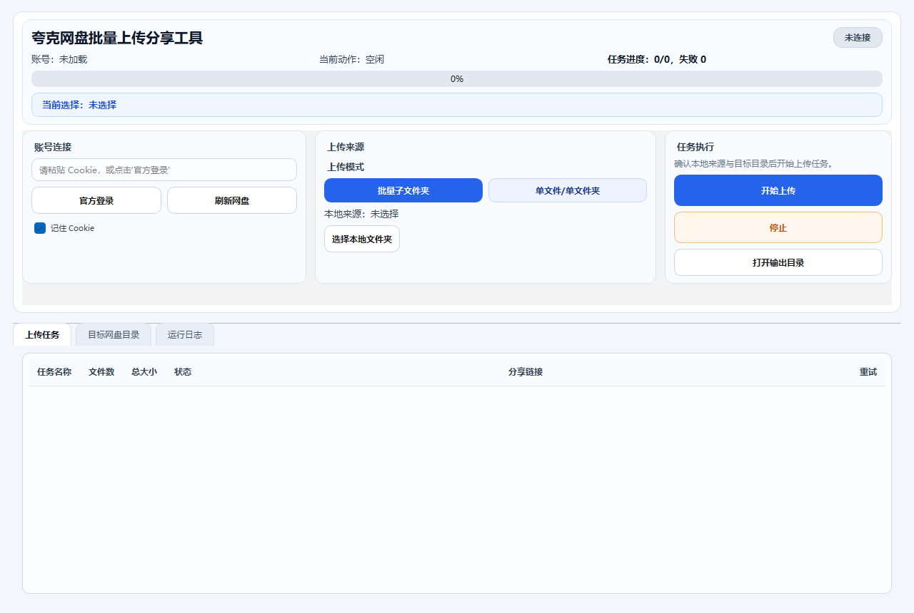

# Quark Pan Uploader

[](https://github.com/luxiaosen8/quark-pan-uploader/releases)
[](./LICENSE)
[](https://www.python.org/)
[](https://www.microsoft.com/windows)

一个基于 **Python 3.12 + PySide6** 的 Windows 桌面工具，用于将本地文件批量上传到夸克网盘，并在上传完成后生成分享链接。

## 下载

### Windows 预构建包

- [查看最新 Release 页面](https://github.com/luxiaosen8/quark-pan-uploader/releases/latest)
- [查看全部历史版本](https://github.com/luxiaosen8/quark-pan-uploader/releases)

### 使用方式

1. 从最新 Release 页面下载并解压 Windows ZIP 包
2. 运行 `quark_uploader.exe`
3. 首次启动后，程序会在本地自动创建 `output/` 与 `.local/` 目录

如果你希望自行验证完整性，可以使用发布页中的 `SHA256` 文件进行校验。

## 截图



## 功能亮点

- **批量子文件夹上传**：扫描本地根目录下一级子文件夹并逐项执行上传
- **单目标上传**：支持直接上传单个文件夹或单个文件
- **受控并发上传**：默认启用任务级并发与 multipart 分片并发，兼顾吞吐和稳定性
- **远端目录选择**：刷新并浏览夸克网盘目录树，选择上传目标位置
- **分享链接生成**：上传完成后自动为远端项目创建分享链接
- **结构化输出**：生成结果汇总、运行归档与日志输出目录
- **桌面化工作台 UI**：上栏操作区 + 下栏标签页工作区，适合持续操作与结果查看
- **统一交互反馈**：主窗口与官方登录弹窗补齐 hover / focus / disabled / busy 状态

## 快速开始

### 环境要求

- Windows 10 / 11
- Python 3.12+
- 建议使用虚拟环境

### 安装依赖

#### 方式一：使用标准虚拟环境

```bat
python -m venv .venv
.\.venv\Scripts\activate
python -m pip install -e .
```

#### 方式二：使用 uv

```bat
uv sync
```

### 启动应用

```bat
python -m quark_uploader.main
```

如果你已经处于项目虚拟环境，也可以使用：

```bat
.\.venv\Scripts\python.exe -m quark_uploader.main
```

## 使用流程

1. 输入 Cookie，或点击 **官方登录**
2. 点击 **刷新网盘** 获取远端目录树
3. 选择本地来源：
   - 批量子文件夹
   - 单文件夹
   - 单文件
4. 选择网盘中的远端目标目录
5. 点击 **开始上传** 执行任务
6. 在 **上传任务 / 目标网盘目录 / 运行日志** 标签页中查看进度与结果

## 打包

仓库已提供以下 Windows 打包文件：

- `scripts/build_windows.ps1`
- `quark_uploader.spec`
- `windows_version_info.txt`

执行：

```powershell
powershell -ExecutionPolicy Bypass -File .\scripts\build_windows.ps1
```

## 输出与配置

运行时默认会使用以下本地目录：

- `output/`：结果与日志输出目录
- `.local/app_settings.json`：本地设置文件

这些目录会在运行时自动创建，属于本地运行产物，不应提交到版本控制。

当前版本额外支持以下本地配置项：

- `job_concurrency`：任务级并发数，默认 `2`
- `part_concurrency`：分片级并发数，默认 `3`
- `ui_update_interval_ms`：UI 聚合刷新间隔，默认 `120`

以上配置第一阶段仅写入本地设置，不在主界面暴露。

## 安全说明

- 不要提交真实 Cookie、Token、`.env`、日志或输出目录内容
- 共享问题样例前，请先脱敏 Cookie、分享链接、目录名和日志内容
- 调试模式下可能生成额外日志，公开分享前请确认已清理

更多说明见：[SECURITY.md](./SECURITY.md)

## 已知限制

- 当前项目主要面向 **Windows 桌面环境**
- 依赖夸克网盘有效登录态或 Cookie
- 当前公开仓库聚焦应用源码与公开协作文档，不包含内部测试与过程性设计文件

## 发布信息

- 仓库地址：[luxiaosen8/quark-pan-uploader](https://github.com/luxiaosen8/quark-pan-uploader)
- 最新发布：[Releases](https://github.com/luxiaosen8/quark-pan-uploader/releases)
- 当前源码版本：`v0.2.0`

## 协作

- 贡献说明：[CONTRIBUTING.md](./CONTRIBUTING.md)
- 安全策略：[SECURITY.md](./SECURITY.md)

## 许可证

本项目采用 [MIT License](./LICENSE)。
